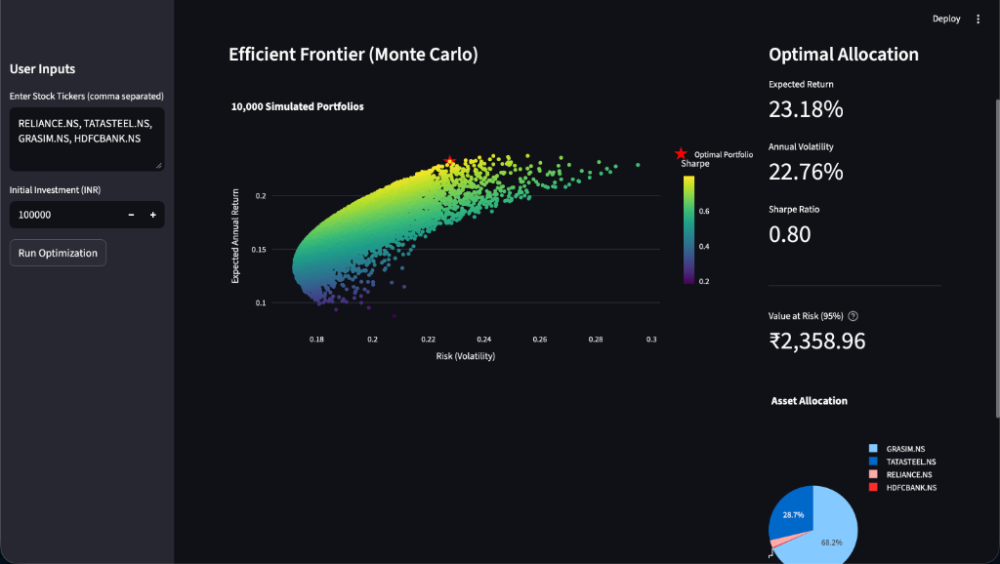

# Quantitative Portfolio Optimization & Risk Engine


A local Python application that performs quantitative analysis on stock portfolios. It fetches historical data, calculates risk metrics, and uses Monte Carlo simulations to recommend optimal asset allocation based on the Sharpe Ratio.



## Project Goal
To build a robust tool for investors and analysts to visualize the Efficient Frontier and determine the optimal portfolio allocation for a given set of assets, minimizing risk while maximizing expected returns.

## Features
- **Data Pipeline**: Fetches 5 years of historical stock data using `yfinance`.
- **Local Caching**: Stores downloaded data in a SQLite database (`portfolio_data.db`) to ensure efficiency and persistence.
- **Monte Carlo Simulation**: Runs 10,000 portfolio simulations to map the Efficient Frontier.
- **Risk Metrics**: Calculates Annualized Volatility, Expected Return, Sharpe Ratio, and Value at Risk (VaR) at 95% confidence.
- **Interactive Dashboard**: Built with Streamlit and Plotly for dynamic visualization of the Efficient Frontier and asset allocation.

## Tech Stack
- **Language**: Python 3.12+
- **Data Source**: yfinance
- **Database**: SQLite3
- **Math & Stats**: NumPy, Pandas
- **Visualization**: Streamlit, Plotly Express, Plotly Graph Objects

## Installation

1. Clone the repository:
   ```bash
   git clone <repository-url>
   cd "Quantitative Portfolio Optimization"
   ```

2. Create a virtual environment (optional but recommended):
   ```bash
   python -m venv venv
   source venv/bin/activate  # On Windows use `venv\Scripts\activate`
   ```

3. Install dependencies:
   ```bash
   pip install -r requirements.txt
   ```

## Usage

### One-Click Run (macOS)
Double-click the `run_app.command` file in the project folder. This will automatically set up the environment and launch the application.

### Manual Run
1. Run the Streamlit application:
   ```bash
   streamlit run app.py
   ```

2. The application will open in your default web browser (usually at `http://localhost:8501`).

3. In the sidebar:
   - Enter the stock tickers you want to analyze (comma-separated, e.g., `RELIANCE.NS, TCS.NS`).
   - Enter your initial investment amount.
   - Click "Run Optimization".

4. View the results:
   - **Efficient Frontier**: A scatter plot showing risk vs. return for all simulated portfolios.
   - **Optimal Portfolio**: The portfolio with the highest Sharpe Ratio is highlighted.
   - **Metrics**: Detailed breakdown of returns, volatility, and VaR.
   - **Allocation**: A pie chart showing the recommended weight for each asset.

## Financial Concepts
- **Log Returns**: Used for time-additivity in statistical modeling.
- **Sharpe Ratio**: A measure of risk-adjusted return.
- **Value at Risk (VaR)**: Estimates the maximum potential loss over a specified time frame with a given confidence level.

## License
[Your License Here]
